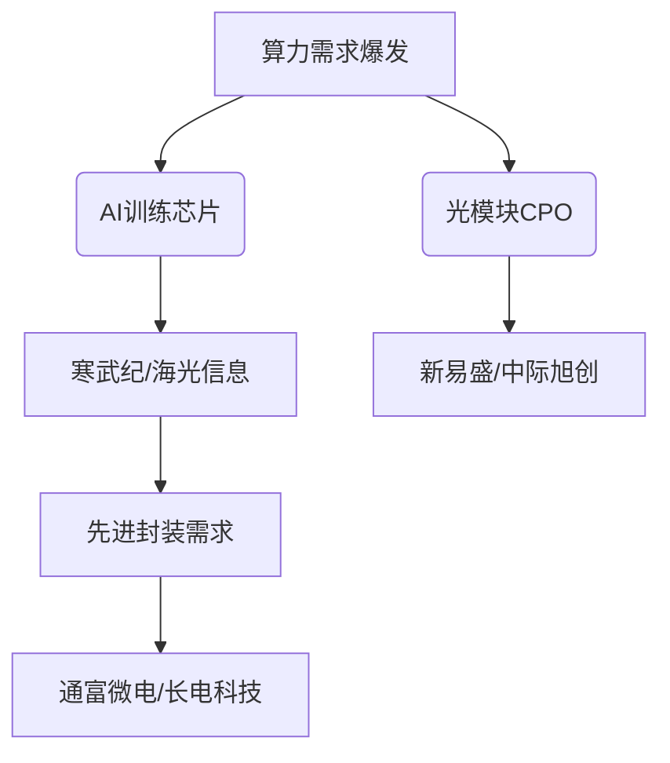

--- 
layout: post
title: "theme_research_半导体_2025-10-21"
date: 2025-10-21 09:14:17 +0800
--- 

# 半导体行业市场研究摘要

## 简要部分
### 主要话题与市场趋势概述
当前半导体行业核心驱动力来自**全球算力需求爆发**、**AI芯片技术商业化突破**及**国产替代政策加速**。光模块（CPO）、AI芯片、功率半导体成为三大增长极，宽基指数成为机构布局科技行情的重要工具。

### 十大关键交易影响信息
1. 海外大客户上修2026年1.6T光模块采购计划，**直接推升新易盛/中际旭创年内涨幅超300%**  
2. 寒武纪单季度营收同比增23倍，**AI芯片国产化可行性验证**  
3. 国家"毫秒用算"专项行动发布，**奠定光通信技术战略地位**  
4. 士兰微200亿元12英寸模拟芯片项目启动，**IDM模式高端产能加速扩张**  
5. 科创板硬科技企业并购重组活跃，**海光信息+中科曙光合体重构算力产业链**  
6. 科创债累计发行1.77万亿元，**科技企业债券融资渠道拓宽**  
7. 私募股权基金参与90%科创板企业投资，**一级市场耐心资本沉淀加速**  
8. A股专业机构科技股持仓占比提升12个百分点，**中长期资金配置转向明显**  
9. "三年倍增"充电设施政策落地，**功率半导体需求增量刚性化**  
10. 双创50指数20%涨跌幅机制，**成为杠杆化布局科技赛道工具**

---

## 详细分析

### 1. 事件概述
半导体行业迎来**政策+技术+资本**三重复合驱动：  
- **技术突破**：CPO技术解决算力瓶颈，头部厂商获海外大订单  
- **财务验证**：寒武纪连续四季度盈利，存货周转率提升印证需求韧性  
- **资本扩张**：士兰微200亿元IDM项目落地，产能规划对标国际一线  
- **制度创新**：科创板增设科创成长层，商业航天/低空经济企业上市通道拓宽  

### 2. 核心驱动与投资逻辑
**第一层：政策红利释放**  
- 工信部专项支持算力基础设施，CPO被明确定位为关键技术  
- 科创板并购重组简化审核（"科创板八条"），头部企业整合提速  
- 科创债贴息+税收优惠降低融资成本30-50BP  

**第二层：技术迭代窗口**  
- 1.6T光模块进入量产爬坡阶段，单瓦效能提升40%驱动更换周期  
- 国产7nm GPU芯片流片成功，设计-制造协同突破  
- SiC MOSFET良率突破75%，车规级认证完成  

**第三层：资本结构迁移**  
- 基本养老保险基金科技持仓占比升至21%，配置久期拉长至5-7年  
- 硬科技REITs试点开启，IDM模式厂房纳入资产证券化标的  

### 3. 相关资产影响
**重点ETF配置逻辑**  
| 标的                | 关键特征                          | 风险收益比 |
|---------------------|---------------------------------|-----------|
| 双创龙头ETF(588330) | 覆盖50只战略新兴产业龙头，半导体权重38% | 高波动高弹性 |
| 科创债ETF           | 科创企业信用债+可转债组合，久期3.5年  | 防御性配置 |

**细分领域传导路径**  

### 4. 主要风险与免责
**核心风险点**  
- **技术替代风险**：CPO技术路径或被硅光方案颠覆  
- **地缘政治扰动**：ASML EUV维护许可存在中断可能  
- **产能错配风险**：12英寸晶圆厂集中投产或导致2028年产能过剩  
- **流动性风险**：双创50指数成分股平均换手率4.2%，极端行情冲击成本高  

**免责声明**  
本报告基于公开信息分析，不构成任何投资建议。半导体行业存在明显的技术迭代与政策调整风险，过去业绩不代表未来表现。ETF产品受底层指数编制规则及市场流动性等多重因素影响，投资者需根据风险承受能力审慎决策。报告涉及的个股案例仅供行业分析参考，非标的推荐。