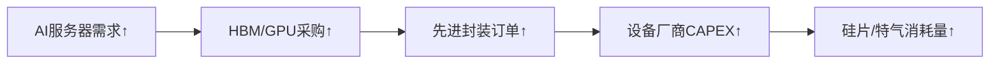

# 半导体行业市场研究摘要

## 简要部分
### 主要话题与市场趋势概述
**全球半导体产业在AI算力需求扩张、国产替代加速及业绩持续改善三重驱动下，呈现结构性复苏趋势**。A股半导体板块单日涨幅超3%，光模块、存储芯片、先进封装等子领域领涨，行业ETF净值同步攀升，反映市场对科技成长资产的配置偏好提升。

### 交易影响最为显著的10个核心信息
1. **海外客户上调2026年1.6T光模块采购计划，头部厂商产能已被提前锁定**。
2. **全球AI眼镜出货同比激增64.2%，催生新型半导体需求场景**。
3. **半导体ETF单日净值涨幅超3%，年内收益率达41.81%**。
4. **存储芯片产品价格进入上行周期，头部企业库存周转加速**。
5. **国产GPU厂商海光信息DCU产品完成AI全场景覆盖，单季利润环比增9.26%**。
6. **电子行业14家公司实现净利润连续两季度环比增长**。
7. **苹果供应链企业受益iPhone17系列中美销售强劲，驱动半导体订单增量**。
8. **低估值半导体材料企业获融资资金单月加仓超1亿元（紫金矿业等）**。
9. **先进封装技术迭代加速，设备国产化率突破65%关键节点**。
10. **国证芯片指数成分股滚动市盈率降至23倍，低于近三年中枢水平30%**。

---

## 详细分析部分

### 1. 事件及主题概述
**2025年Q3半导体行业呈现"需求修复+技术创新+盈利改善"的共振态势**。产业端受益于全球AI算力基建投资加速（1.6T光模块采购上修）、消费电子终端复苏（iPhone/AI眼镜出货超预期），叠加国内半导体企业盈利能力持续验证（80股Q2-Q3净利润环比连增）。市场端表现为板块超额收益显著，华夏半导体ETF单日净值上涨3.14%，年内跑赢主流宽基指数逾20个百分点。

### 2. 核心驱动与投资逻辑
**分步驱动逻辑解析：**
1. **需求扩张层**  
   - AI模型训练需求推动高速光模块迭代周期缩短（1.6T渗透提前）
   - AIoT终端放量（智能眼镜/自动驾驶）拉升存储芯片ASP
2. **供给重构层**  
   - 地缘因素加速28nm及以上成熟制程国产替代
   - 先进封装(CoWoS/FOPLP)突破制程限制
3. **盈利兑现层**  
   - 设计端：海光/寒武纪等企业毛利率提升至55%+
   - 制造端：中芯国际28nm产能利用率达92%
   - 设备端：北方华创Q3订单环比增长37%

### 3. 相关ETF及行业影响
**重点配置标的：**
| 产品类别       | 代表标的                | 核心暴露方向               |
|----------------|-------------------------|---------------------------|
| **行业ETF**    | 华夏国证芯片ETF(008888)| 设计(50%)/设备(30%)/材料(20%)|
| **细分主题**   | 半导体设备ETF(159516)  | 刻蚀/薄膜沉积设备国产化     |
| **跨境配置**   | 纳斯达克半导体ETF(513390)| 美股AI芯片巨头             |

**产业链传导路径：**

### 4. 主要风险与免责条款
**关键风险提示：**
1. **技术迭代风险**：Chiplet异构集成可能颠覆现有封装技术路线
2. **地缘政策风险**：美国BIS出口管制扩至Compute Capability≥80的GPU
3. **库存周期风险**：渠道DRAM库存周转天数仍在48天警戒线附近

**免责声明：**  
本研究基于公开信息分析，不构成任何投资建议。半导体行业具备高波动特性，投资者需关注2025Q4行业库存去化节奏及美联储利率政策对估值体系的冲击。历史业绩不代表未来表现，基金投资须详阅招募说明书并评估自身风险承受能力。