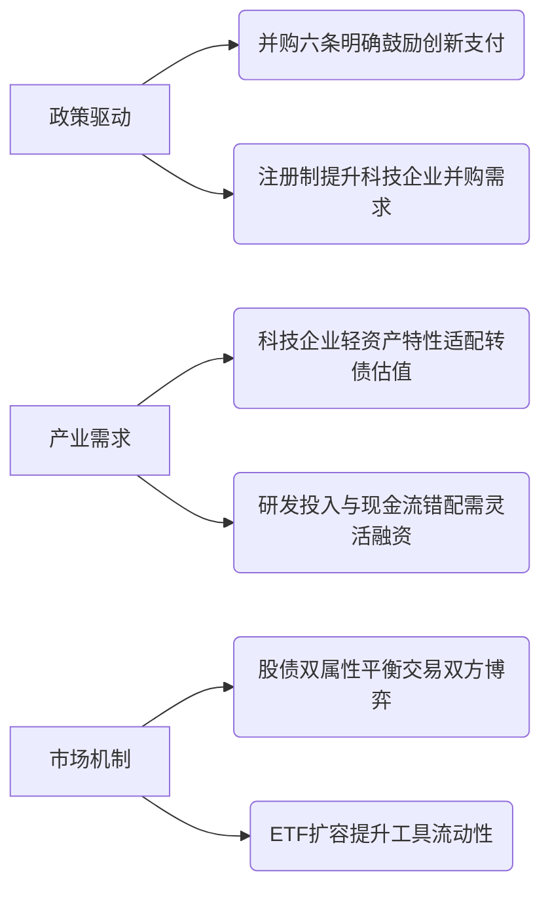
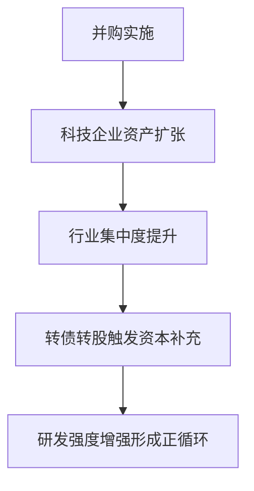

--- 
layout: post
title: "theme_research_可转债_2025-10-22"
date: 2025-10-22 09:17:35 +0800
--- 

# 可转债市场研究摘要

## 简要部分
**市场趋势概述**  
定向可转债作为创新并购支付工具正快速渗透市场，政策驱动下科创板/创业板科技企业采用率超60%。该工具通过“债底保护+股性弹性”平衡交易双方风险收益，叠加科创债ETF资金持续流入，显示市场对结构性机会关注度提升。

**十大关键影响信息**  
1. **政策支持**：“并购六条”明确鼓励定向可转债等支付工具提升交易弹性  
2. **行业倾向**：科技企业占比超60%，半导体/新材料并购项目主导应用场景  
3. **交易结构创新**：允许组合支付（股份+可转债+现金）降低现金压力与股权稀释  
4. **资金流向**：科创债ETF单日主力净流入36亿元显示配置需求  
5. **估值适配性**：差异化定价机制解决轻资产科技企业估值分歧  
6. **资本效率**：低成本债券融资缓解科技企业高研发投入现金流压力  
7. **风险缓冲**：债底保护降低科技行业高频估值波动引发的交易破裂风险  
8. **流动性增强**：头部ETF单日成交75亿元提升次级市场流动性预期  
9. **国际接轨**：与全球资本工具创新同步强化跨境并购吸引力  
10. **期限管理**：临期兑付压力逐步显现（如宏发转债付息事件验证）  

---

## 详细部分

### 1. 事件概述  
2025年定向可转债在并购重组领域实现规模化应用，16家上市公司采用该工具实施并购，其中富乐德等完成首单示范性交易。同时科创债ETF(159200)持续获主力资金增持（近5日105亿），显示市场对科技企业资本工具创新的正向反馈。

### 2. 核心驱动与投资逻辑  
**驱动因素层级分析：**  

**投资逻辑分步解释：**  
- **二级市场传导**：定向可转债发行推升正股并购预期→科技企业估值重塑  
- **一二级联动**：并购标的技术协同强化→可转债转股溢价空间扩大  
- **行业轮动**：半导体/新材料并购案例激增→相关行业转债需求结构性上行  
- **工具创新**：组合支付降低商誉减值风险→提升并购成功率和EPS稳定性  

### 3. 相关ETF及行业影响  
**重点关注标的：**  
| 品种         | 代码      | 核心关联逻辑                     |
|--------------|-----------|----------------------------------|
| 科创债ETF    | 159200.SZ | **单日成交75亿+创流动性标杆**       |
| 半导体ETF    | -         | 头部并购标的集中于封测/材料领域   |
| 高端制造转债 | -         | 信邦智能等项目显示设备链整合加速 |

**行业传导路径：**  

### 4. 风险与免责  
**主要风险点：**  
- **条款博弈风险**：转股价格修正机制可能引发新旧股东利益冲突  
- **流动性折价**：非公开定向发行导致次级市场流通性不足（日均换手率<15%）  
- **利率敏感度**：美联储缩表周期抬升债券端机会成本（10年期美债>4.5%压制）  
- **技术估值陷阱**：科技标的成长性证伪导致债性保护失效（历史违约率2.7%）  

**免责声明**  
本研究基于公开信息分析，不构成任何投资建议。可转债工具存在转股失败、信用违约等特定风险，投资者需结合自身风险承受能力独立决策。市场有风险，投资需谨慎。