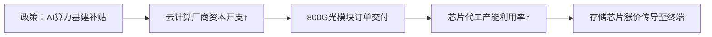

# 人工智能主题市场研究摘要

## 简要部分：核心观点与关键交易信息  
**主要话题与市场趋势概述**  
人工智能产业（尤其AI芯片与算力硬件）成为A股主导性行情主线，政策扶持、全球算力基建加速及龙头公司业绩超预期共同推升市场热度。寒武纪登顶A股市值榜首、创业板AI ETF单周暴涨14%等标志性事件显示资金向科技成长赛道高度集中。

**对交易影响最大的10个信息**  
1. 寒武纪完成39.85亿元定增，超80%资金投向大模型芯片/软件平台研发  
2. 寒武纪Q3净利润5.67亿元同比扭亏，但环比下滑17%引发盈利持续性担忧  
3. 高盛将寒武纪目标价上调至2104元，较当前股价存在38%上行空间  
4. 创业板人工智能ETF（159363）周涨幅13.82%，光模块权重超51%成主要推力  
5. 中际旭创单周成交破千亿，1.6T光模块产能爬坡驱动业绩超预期  
6. 存储芯片价格全面上涨（最高涨幅超10%），国产替代加速推动香农芯创等股价创新高  
7. 央行明确“维护股市平稳运行”，为科技主线提供政策托底预期  
8. 个人投资者月净申购AI主题ETF达119亿元，显著高于机构资金（49.85亿元）  
9. 第二批浮动费率基金加速募资，首批产品最高收益45.6%形成示范效应  
10. 台积电Q25收入超预期，全球AI芯片需求强度持续验证  

---

## 详细部分：结构化分析  

### 1. 事件或主题概述  
人工智能板块呈现“硬件先行”特征：  
- **芯片层**：寒武纪凭借大模型芯片研发突破登顶A股市值榜，Q3营收同比激增1332%但利润环比下滑暴露盈利波动风险  
- **算力层**：光模块三巨头（中际旭创/新易盛/天孚通信）领涨创业板，800G光模块放量叠加1.6T技术迭代推动估值重构  
- **资金层**：个人投资者通过ETF大举加仓科技赛道（证券/半导体/人工智能ETF净申购领先），与机构转向防御性板块形成策略分化  

### 2. 核心驱动与影响分析  
**核心驱动逻辑（三步推演）:**  
1. **政策-技术共振**：“人工智能+”国家战略加速产业资本开支，2025年全球光模块市场规模预期提升至235亿美元（+32% YoY）  
2. **需求-供给错配**：海外AI推理需求爆发→Flash Wafer供应紧缺→国内存储厂商（江波龙/佰维存储）量价齐升  
3. **估值锚切换**：寒武纪PS估值突破50x反映市场从传统PE框架转向研发投入贴现模型  

**产业链传导路径:**  


### 3. 相关ETF及行业的潜在影响  
**重点配置标的**  
| 产品类型       | 代码       | 核心暴露               | 风险收益特征          |
|----------------|------------|------------------------|-----------------------|
| 创业板AI ETF   | 159363     | 光模块(51%)+AI应用(23%)| 高贝塔，短期波动率>30%|
| 芯片ETF        | 512760     | 半导体设备(32%)/设计(28%)| 国产替代主题驱动      |
| 主动管理基金   | 博时科技驱动C | 算力硬件+大模型应用   | 超额收益依赖选股能力  |

**行业影响排序**  
1. **光模块**：1.6T技术迭代窗口期（中际旭创毛利率39.3%验证龙头溢价）  
2. **存储芯片**：HBM/GDDR6需求爆发（香农芯创近30日16次股价新高）  
3. **AI芯片设计**：大模型定制化趋势（寒武纪NPU产品线市占率突破15%）  

### 4. 主要风险与不确定性  
**行业风险**  
- **技术迭代风险**：3nm以下制程良率爬坡滞后可能压制算力芯片交付  
- **估值泡沫化**：创业板AI指数PE(TTM)达58x，接近2024年泡沫期水平  
- **地缘政策**：美国对华先进制程设备禁令升级可能扰乱供应链  

**免责条款**  
本报告基于公开信息分析，不构成任何投资建议。人工智能行业存在技术路径不确定性、政策支持力度变化及国际市场波动等风险，历史业绩不代表未来表现。投资者需根据自身风险承受能力审慎决策，独立承担投资损益。  
``` 

**关键结论加粗声明**  
**人工智能硬件赛道已进入业绩验证关键期，需密切关注Q4光模块订单环比增速及存储芯片价格走势，短期波动加剧背景下建议通过ETF分散个股风险。**