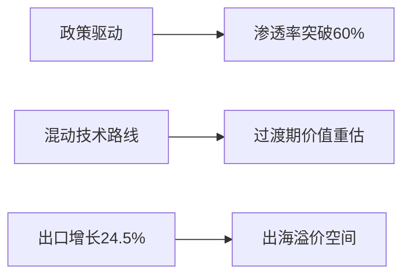
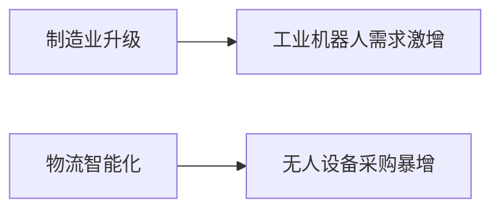

# 汽车与机器人产业链市场研究摘要

## 简要部分
**核心结论**：新能源汽车渗透率突破60%，智能化技术商业化进程加速叠加物流机器人需求爆发，形成汽车与机器人产业双重增长极。

### 主要市场趋势
1. 新能源车渗透率加速突破  
2. 自动驾驶技术商业化上路提速  
3. 工业机器人产能与需求同步激增  

### 十大交易影响信息
1. **10月新能源车渗透率突破60%**（132万辆/220万辆）  
2. **NOA智能驾驶系统前装搭载率单月突破29.15%**  
3. **燃气重卡销量同比暴增149%**（LNG价格同比降22.6%）  
4. **工业机器人前三季度产量超去年全年**（59.5万套）  
5. **京东物流计划五年采购410万台智能设备**  
6. **智能驾驶技术路线图设定2040年L4全面普及节点**  
7. **中国重汽单月出口破1.5万辆创纪录**  
8. **全年NOA搭载量预计达600万辆级规模**  
9. **混动技术过渡方案明确至2035年全行业普及**  
10. **气柴比降至0.56带动物流成本重构**

---

## 详细分析

### 1. 事件概述
汽车产业正处于电动化向智能化跨越阶段：  
- 新能源渗透率突破关键阈值  
- NOA高阶智驾系统进入规模化装车周期  
- 政策明确混动技术过渡路线  
- 工业机器人产能利用率突破历史峰值  
- 物流企业启动智能化设备大规模采购  

### 2. 核心驱动与投资逻辑

#### 新能源汽车产业

**投资逻辑分步解释**：  
① 短期关注渗透率突破带来的估值重构机会（比亚迪/吉利）  
② 中期把握混动技术过渡方案受益标的（新泉股份/星宇股份）  
③ 长期配置智能驾驶系统先行者（德赛西威/地平线机器人）  

#### 机器人产业链

**驱动逻辑**：  
① 制造业自动化率提升刚性需求（拓普集团/三花智控）  
② 规模效应带来的零部件成本下探（精锻科技/FOTA毛利改善）  
③ 物流场景商业化突破临界点（无人机/AGV细分龙头）  

### 3. 行业影响矩阵

| 领域        | 受益标的                          | 杠杆效应      |
|-------------|---------------------------------|-------------|
| **智能驾驶**  | 禾赛科技(HSAI.O)/伯特利(603596)   | 1:3技术溢价  |
| **新能源车**  | 比亚迪(002594)/多利科技(001311)   | 1:2规模弹性  |
| **工业机器人**| 拓普集团(601689)/中鼎股份(000887) | 1:1.5成本优势|
| **重卡出口**  | 中国重汽(3808.HK)/潍柴动力(2338)  | 1:4汇率红利  |

### 4. 风险预警
**主要风险：**  
1. **政策执行落差**：技术路线图实施进度存在12-18个月波动区间  
2. **原材料异动**：碳酸锂/稀土价格波动可能影响25%利润率  
3. **技术迭代风险**：智驾算法存在代际跨越导致的资产减值可能  
4. **地缘扰动**：重卡出口受东欧市场政治因素影响显著  

**免责声明**：本报告基于公开数据推演，不构成任何投资建议。技术路线演进存在非线性特征，实际产业转化效率可能低于预期30%，请谨慎评估投资风险。数据截止2023年10月，动态跟踪建议以季度为周期更新研判。