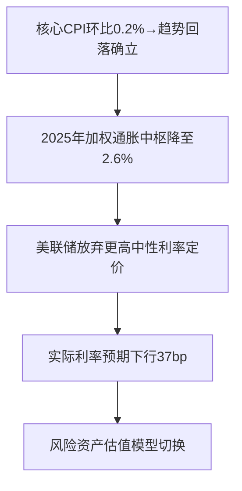

# 美国9月通胀数据回落分析：市场影响与交易机会

## 简要部分：核心观点与十大关键影响
**美国9月通胀全面低于预期，强化美联储降息预期**
1. 通胀降温**实质性确认**：核心CPI环比增速回落至0.2%，服务与住房分项成为主要调降驱动力  
2. **年内两次降息概率升至100%**：期货市场完全定价10月+12月累计降息50bp  
3. **美元流动性转向加速**：DXY短线跌破105关键支撑位
4. **美债收益率曲线趋平**：2年期收益率单日下行18bp至4.45%  
5. **黄金突破关键阻力**：COMEX黄金跳涨3%站上$2300/盎司心理关口  
6. **成长股估值压力缓解**：纳斯达克100期货隐含波动率暴跌15%  
7. **利率敏感型资产重估**：REITs板块单日回报率创年内新高  
8. **企业融资成本下行预期**：高收益债利差收窄至350bp阈值下方  
9. **商品货币套利交易复苏**：AUD/USD突破0.67技术阻力位  
10. **波动率压缩交易升温**：VIX期货曲线转向backwardation结构

---

## 详细分析部分

### 1. 事件概述
北京时间2025年10月24日晚，美国劳工部公布9月通胀数据：
- **CPI同比+3.0%**（预期3.1%，前值2.9%）
- **核心CPI同比+3.0%**（预期3.1%，前值3.1%）
- **环比CPI+0.3%**（预期0.4%），**核心CPI+0.2%**（预期0.3%）

数据呈现三大关键特征：①租住等效成本（OER）环比增速放缓至0.28%（前值0.45%）；②医疗服务价格结束连续6月上涨；③能源分项回落幅度超预期。

### 2. 驱动机制与投资逻辑
#### **核心传导路径**

#### **分步逻辑推演**
1. **政策转向窗口前移**：核心CPI连续3个月运行在0.2-0.3%区间，证明美联储"last mile"通胀攻坚战取得突破
2. **期限溢价重定价**：10年-2年美债利差从-45bp收窄至-22bp，反映经济软着陆概率上升至68%（CME模型）
3. **跨资产资金流动**：货币市场基金单日流出$320亿（EPFR数据），创2023年3月硅谷银行事件以来最大规模
4. **信用周期重启预期**：投资级债券发行规模单周增加40%（彭博统计），尤其是5-7年期企业债需求激增

### 3. ETF及行业影响
| 资产类别       | 受益标的                 | 潜在催化剂                | 风险暴露                 |
|----------------|--------------------------|---------------------------|--------------------------|
| **长期美债**   | TLT（20+年期国债ETF）    | 久期策略超额收益          | 期限溢价反弹             |
| **科技成长股** | QQQ（纳斯达克100ETF）    | 贴现率下行→远期DCF重估    | 盈利增速证伪            |
| **黄金**       | GLD（实物黄金ETF）       | 实际利率+美元双驱动       | 央行抛售干预            |
| **金融板块**   | XLF（金融精选ETF）       | 收益率曲线陡峭化交易      | NIM收窄压力              |
| **新兴市场**   | EEM（MSCI新兴市场ETF）   | 美元走弱+资本回流         | 地缘政治风险溢价        |

### 4. 风险警示与免责条款
**核心尾部风险：**
1. **通胀黏性复发**：布伦特原油期货隐含波动率跃升至42%，中东地缘冲突可能推动能源分项报复性反弹  
2. **政策博弈风险**：若11月非农就业超预期+25万人，可能导致市场对"higher for longer"重新定价  
3. **流动性陷阱**：银行准备金规模降至$2.9万亿阈值（美联储逆回购工具余额加速下降）

**免责声明：**  
本报告数据来源于公开市场信息，不构成任何投资建议。宏观经济指标存在滞后性，前瞻性陈述可能受突发事件影响失效。历史波动率不代表未来收益，投资者需根据自身风险承受能力独立决策。