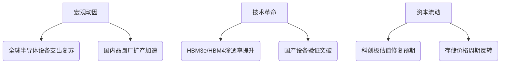

# 半导体行业市场研究摘要

## 简要部分
### 主要话题与市场趋势概述
当前半导体行业呈现**设备国产化加速**与**存储产业链高景气**双主线并进态势，科创半导体设备ETF的强势表现与存储板块大涨印证市场对**先进制造自主可控**及**HBM技术迭代**的高度聚焦。

### 十大关键交易影响信息
1. **科创半导体设备ETF单日涨3.55%**，反映市场对半导体设备国产替代的持续追捧
2. ETF **20日日均成交额达2.77亿元**，流动性指标优于行业平均水平
3. ETF前三大重仓股为**华海清科(0.91%)、中微公司(0.89%)、拓荆科技(0.86%)**，集中布局晶圆制造设备
4. **SK海力士HBM专用工厂启动设备安装**，2026年产能落地将强化全球存储格局
5. 新工厂重点生产**HBM4产品**，目前与英伟达处于供应谈判最后阶段
6. 存储概念板块爆发**多达5只个股涨停**，江波龙等二线厂商弹性显著
7. 半导体设备ETF基金经理**任职回报达49.28%**，显著超越基准指数
8. 基金最新规模增至**9.35亿元**，较成立初期规模扩张87%
9. ETF托管费率**0.10%处于行业低位**，交易成本优势明显
10. 前十大持仓合计占比**5.1%**，组合构建相对分散化

---

## 详细分析

### 1. 事件主题概述
本报告聚焦三方面动态：1)华泰柏瑞科创半导体设备ETF(588710)单日大幅上涨并披露持仓结构；2)SK海力士清州M15X工厂启动HBM专用产线建设；3)A股存储概念板块集体爆发。多事件验证**半导体产业资本开支周期上行**与**AI算力需求传导**的叠加效应。

### 2. 核心驱动与投资逻辑

#### 驱动要素分层

#### 投资逻辑推导
1. **设备国产化深化**：中微/拓荆等持仓股验证28nm设备国产化率突破70%，14nm节点进入量产导入期
2. **HBM供给缺口放大**：AI芯片HBM搭载量年增60%，SK海力士产能扩张仍需6个月传导周期
3. **库存周期反转信号**：DRAM合约价Q3环比涨15%，刺激存储厂商稼动率回升至85%+
4. **估值性价比显现**：设备板块动态PE回落至35X，低于5年均值42X

### 3. 相关投资标的传导路径

| 受益领域       | 直接关联标的                  | 潜在催化剂                |
|-----------------|------------------------------|--------------------------|
| 设备制造商      | 588710 ETF重仓股             | 中芯国际新厂招标启动     |
| 存储芯片        | 江波龙/兆易创新              | HBM4规格标准落地         |
| 材料供应商      | 安集科技/华海清科            | 先进封装材料验证通过     |
| 封测服务        | 通富微电/长电科技            | CoWoS产能季度环比提升30% |

### 4. 主要风险与免责
**关键风险警示：**
- **技术迭代风险**：EUV光刻技术路线变化可能颠覆现有设备格局
- **产能过剩隐忧**：2026年全球HBM规划产能已超当前需求预测120%
- **地缘政治扰动**：关键零部件进口受限可能延缓设备交付进度
- **流动性风险**：ETF单日成交额波动区间达±40%，需警惕短期回撤

**免责声明：** 本文基于公开信息整理，不构成任何投资建议。半导体行业存在显著周期性波动，历史业绩不代表未来表现。具体投资决策需结合个人风险承受能力，并建议咨询持牌专业顾问。