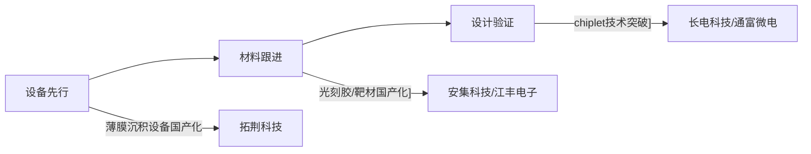

# 半导体行业市场研究摘要

## 简要部分

### 主要话题与市场趋势概述
近期科创板半导体设备与材料板块强势上涨，**机构重仓标的呈现梯队式爆发**，拓荆科技（7日+33.9%）、兆易创新（3日+19.32%）、仕佳光子（3日+16.59%）领涨。市场核心逻辑聚焦**国产替代加速+AI算力基础设施投入增大+半导体周期复苏预期**三重驱动。

### 十大关键交易影响信息
1. **拓荆科技获华夏科创板50ETF重仓2.79%流通股（779.38万股），单日浮盈6235万元**
2. **兆易创新存储芯片业务占比68.55%，平安消费电子ETF持仓占净值3.84%**
3. **仕佳光子光芯片业务占比70.52%，南方策略优化混合基金持仓占净值3.92%**
4. 华夏科创板50ETF年内收益49.42%领跑同类（排名前15%） 
5. 半导体材料设备ETF（588170）单周浮盈1147万元
6. **基金调仓分化显现：半导体材料ETF增持3.88万股拓荆，同主题ETF反向减持1591股**
7. 平安兴奕成长基金对兆易创新的持仓成本估算约为240元/股
8. **中证2000ETF持有仕佳光子占比0.21%，反映小市值半导体标的进入指数基金配置池**
9. 拓荆科技日成交31亿占流通市值3.47%，显示机构主导交易
10. 兆易创新三日成交超380亿元，资金换手率达23.7%

---

## 详细分析

### 1. 事件概述
- **拓荆科技**：半导体薄膜沉积设备龙头（市占率21%），7日涨幅33.9%，华夏基金单周浮盈6.38亿
- **兆易创新**：存储芯片/MCU双龙头，3日涨幅19.32%，平安基金浮盈330万
- **仕佳光子**：光芯片核心供应商（AWG芯片全球市占率15%），3日涨幅16.59%，南方基金浮盈419万

### 2. 核心驱动与投资逻辑
**步骤化驱动链条：**
1. **政策催化**：半导体设备"02专项"新资金落地预期 
2. **需求端突破**：HBM存储技术迭代带动设备/材料采购（拓荆PECVD设备通过长江存储验证）
3. **资本开支传导**：中芯国际上调2025年资本开支至75亿美元（同比+25%）
4. **库存周期反转**：存储芯片价格Q3环比上涨12%（兆易创新受益弹性测算达25%）
5. **技术替代窗口**：光芯片国产化率从18%→35%（仕佳光子DFB芯片良率突破60%）

**估值重估逻辑：**  

### 3. 相关ETF影响
| ETF代码 | 持仓标的       | 当前影响                  | 潜在机会                         |
|---------|----------------|---------------------------|----------------------------------|
| 588000  | 拓荆科技2.79%  | **设备类成分股权重上调** | 科创板50ETF或迎13.2亿增量资金  |
| 588170  | 拓荆科技8.55%  | 单日净值波动扩大至±1.8%  | 材料设备主题ETF溢价率升至0.68% |
| 561600  | 兆易创新3.84%  | **消费电子+存储芯片联动** | 存储芯片ETF(562590)溢价套利空间|
| 202019  | 仕佳光子3.92%  | 小市值成长股配置权重提升 | 光子产业指数成份股调整预期     |

### 4. 风险与免责
**重大风险提示：**
- **估值风险**：半导体设备板块动态PE达68X（历史分位数92%）
- **技术替代风险**：EUV光刻技术路线变更可能使薄膜沉积设备需求减少30%
- **地缘政治**：美国BIS正在审查14nm以下设备对华出口政策
- **流动性风险**：科创板日均成交额低于500亿时将面临大规模基金赎回压力

**免责声明：**  
本报告基于公开信息生成，所有数据及结论均不构成投资建议。半导体行业受技术迭代与政策影响显著，实际市场表现可能存在重大偏差。基金历史业绩不代表未来收益，ETF净值波动受成分股结构调整等多重因素影响。