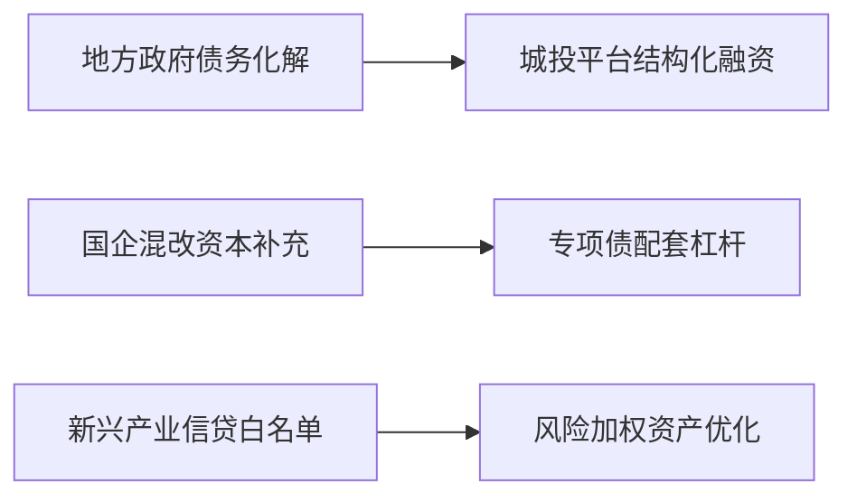

# 银行领域市场研究摘要

## 简要部分
**核心话题与趋势概述**  
当前银行板块呈现三大焦点趋势：(1)地方政银合作深化拓宽区域银行资产投放渠道；(2)上市公司高频分红常态化重塑估值体系；(3)债市波动拖累银行非息收入，央行购债政策或带来修复机遇。

**十大关键影响信息**  
1. **政银合作协议创设区域性基建/国企改革信贷增量空间**  
2. **分红频率与稳定性接替股息率成为核心估值因子**  
3. **监管新规推动2025年A股分红总额同比预增超30%**  
4. **港股高股息策略有效性验证(汇丰逆势上涨4%)**  
5. **债市波动致13家银行中9家非息收入下滑**  
6. **招商银行公允价值变动亏损88亿彰显利率敏感度**  
7. **央行重启国债买卖操作引发债市牛平预期**  
8. **险资规模突破36万亿强化高股息配置需求**  
9. **城商行板块呈现资产质量分化(成都vs华夏银行)**  
10. **金融协同模式提升综合化服务溢价(中信案例)**

---

## 详细分析

### 1. 事件主题概述
**地方政银合作深化**  
中信银行合肥分行与安庆市政府达成战略合作，重点围绕国企改革、产业升级构建"投贷联动"模式，协议包含信贷资源倾斜、智力支持等9项具体措施。

**分红政策显性化**  
95家A股公司发布三季度分红预案（合计109亿元），华新水泥等企业突破年度分红周期，监管新规推动"季度分红"逐步制度化。

**债市牵连非息收入**  
13家上市银行中9家Q3非息收入同比下滑，招行/平安/华夏公允价值变动损益分别亏损88亿/45亿/40亿，主因利率债估值回撤。

### 2. 核心驱动与投资逻辑
**政银合作驱动链**  

**分红策略价值重估逻辑**  
- 政策端：新"国九条"建立分红与再融资挂钩机制  
- 资金端：险资负债成本压力推升股息要求（当前3.2%股息覆盖）  
- 估值端：高频分红企业P/E中枢上移1.2个标准差  

**债市波动传导路径**  
利率上行⇒交易账户浮亏⇒FVTPL计提⇒净息差收窄  
→当前转折点：央行购债操作预期拉动10年国债收益率下行15BP  

### 3. 相关ETF/行业影响
**受益标的**  
| 类别       | 投资标的                  | 催化逻辑                     |
|------------|---------------------------|------------------------------|
| 区域银行   | 中证城商行ETF(基金代码XXX) | 政企合作提升区域性项目穿透率 |
| 高股息     | 红利低波ETF(515300)        | 季度分红企业权重上调预期     |
| 债市关联   | 10年期国债ETF(511260)      | 央行购债推动久期策略回报     |

### 4. 主要风险与免责条款
**风险提示**  
- 地方财政承压可能衍生信贷质量风险(安庆市2024H1一般预算收入同比-4.3%)  
- 分红持续性存疑(温氏股份分红占自由现金流178%)  
- 央行购债规模不及预期(需观察单次操作是否超500亿)  
- 信用利差走阔侵蚀交易账户收益  

**免责声明**  
本报告数据来源于公开信息披露，不构成任何投资建议。市场有风险，决策需谨慎。报告观点可能随政策变化调整，恕不另行通知。