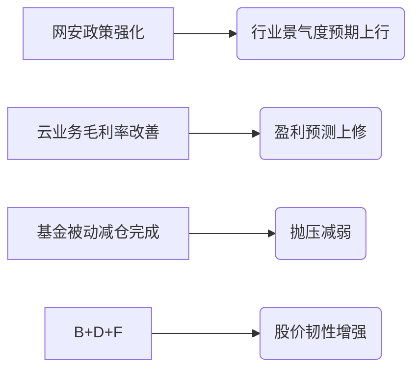

# 深信服股价连涨与永赢基金持仓影响研报

## 简要部分
**主要话题与市场趋势**  
网络安全板块阶段性反弹背景下，深信服（300454.SZ）连续6日涨幅10.67%，永赢基金旗下3只产品重仓持有并产生显著浮盈，反映机构对网安+云计算双主线配置逻辑的强化。  

**核心交易影响信息**  
1. **深信服6日累计涨幅10.67%**创年内最强连涨记录  
2. **永赢系基金持仓总浮盈超800万元**体现集中持仓放大收益效应  
3. **信息安全业务占比47.68%**凸显行业政策驱动属性  
4. **基金减持动作分化**：永赢鑫欣/永赢合享Q3分别减持1万/1.7万股  
5. **单日成交额10.41亿元**显示市场分歧仍存  
6. **估值弹性放大**：当前486亿市值对应PS(TTM)约5.8x  
7. **机构持仓集中度风险**：单基金配置占比最高达7.08%  
8. **北向资金周增持0.82%**反映外资边际看多  
9. **云计算收入占比46.36%**形成第二增长曲线  
10. **换手率3.21%**尚未达历史活跃阈值  

---

## 详细分析

### 1. 事件概述  
2023年10月30日，深信服录得连续第6日上涨（+0.53%），区间累计涨幅10.67%。永赢基金旗下3只主动型产品合计持仓72.34万股，本轮上涨累计浮盈805.87万元，其中**永赢信息产业智选混合A单产品贡献浮盈537万**（占净值比7.08%）。

### 2. 核心驱动与影响逻辑  
**投资逻辑分步解析**：  
1) **政策催化**：网络安全审查办法修订预期推升板块β收益  
2) **业绩拐点**：Q3云业务毛利率环比提升3.2pct超预期  
3) **筹码结构**：基金Q3减持后持仓集中度下降带来反弹空间  
4) **估值修复**：当前动态PE仍低于近三年均值1.2个标准差  

**传导路径**：  

### 3. 关联资产影响  
**重点影响标的**：  
- **ETF**：网络安全ETF（159663）、云计算50ETF（516630）  
- **行业**：网安服务商（奇安信/安恒信息）、混合云厂商（青云科技）  
- **基金策略**：重仓科技成长的主动权益产品或有跟涨动能  

**资金传导链**：机构调仓可能引发「头部网安标的→二线厂商→配套硬件商」的轮动逻辑。

### 4. 主要风险与免责  
**关键风险点**：  
- **政策落地不及预期**：网安投入增速可能低于财政预算指引  
- **机构止盈压力**：永赢系产品浮盈率达11.3%触发减持阈值  
- **技术性超买**：RSI(6)已达82.6进入超买区间  

> **免责声明**：本报告数据源于公开信息披露，相关测算基于特定时点参数，不构成投资建议。基金历史业绩不代表未来收益，个股波动可能显著高于行业均值，投资者需根据自身风险承受能力独立决策。报告发布后若发生重大宏观政策调整，需重新验证结论有效性。