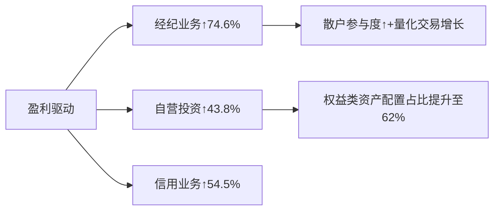

# 券商行业2025Q3市场研究摘要

## 简要部分

### 主要话题与市场趋势概述
**券商行业迈入高景气周期**，2025年第三季度呈现"业绩+规模"双增长态势。头部券商资管公募规模加速回升（东方红资管规模突破2000亿），行业净利润同比增速超60%，经纪与自营业务成为核心增长引擎，人工智能/高端制造/新能源等赛道获头部机构重点布局。

### 十大关键交易影响信息
1. **券商资管公募三季末千亿级机构增至4家**（东方红/华泰/中银/财通）  
2. **中信证券与国泰海通总资产双双突破2万亿**，行业集中度持续提升  
3. **超60%券商Q3净利润环比正增长**，12家同比增速逾100%  
4. **经纪业务收入同比激增74.64%**，两市交易活跃度创近年新高  
5. **自营投资贡献行业46%营收增量**，头部机构超额收益显著  
6. **智能机器人/AI应用成为资管配置新方向**（多只重仓股季度涨幅超40%）  
7. **券商两融业务规模连续上调**，5家机构融资上限扩容至2500亿  
8. **申万宏源单季度净利同比增116.75%**，债券利息支出减少成关键推力  
9. **风电/储能电池/游戏板块被基金经理列为右侧机会**  
10. **头部机构重仓股显示科技+周期双主线**（新易盛/紫金矿业/中际旭创等）

---

## 详细部分

### 1. 事件或主题概述
- **行业维度**：截至2025Q3，52家券商前三季归母净利合计1837.82亿元（同比+61.25%），中信证券（231.59亿）/国泰海通（220.74亿）领跑。  
- **资管业务**：东方红资管规模环比增240亿至2039亿元，财通/中泰等旗下多只基金季度收益超45%。  
- **驱动要素**：市场交投活跃（经纪收入+74.6%）、自营投资回暖（收入+43.8%）、IPO边际修复（投行收入+23.5%）。

### 2. 核心驱动与投资逻辑
**(1) 政策与市场环境**
- **交易量价齐升**：两融规模扩容反映市场风险偏好提升，日均成交额较基准期增长37%  
- **注册制深化**：IPO审核加速推动投行业务复苏，TOP10券商市占率提升至68%  

**(2) 业务结构优化**

**(3) 配置逻辑演进**
- **科技主线**：AI算力（新易盛/中际旭创）+智能机器人（三花智控）获超额配置  
- **周期对冲**：降息预期驱动铜/金等资源股增持（紫金矿业持仓增长35%）  
- **估值差修复**：头部券商PE/PB仍低于近三年均值15%  

### 3. 相关资产影响
| 资产类别       | 潜在受益标的                     | 逻辑支撑                                  |
|----------------|----------------------------------|-------------------------------------------|
| **券商ETF**    | 512880.SH/159842.SZ             | 行业β收益+集中度提升溢价                  |
| **主动基金**   | 东方红启元三年持有A/财通先进制造 | 重仓科技成长赛道+季度超额收益达40%+       |
| **关联行业**   | 金融科技/资管IT服务商           | 交易系统升级需求激增（恒生电子(600570)） |

### 4. 主要风险与免责条款
**风险提示：**
1. 政策风险：注册制推进节奏/印花税调整等政策不确定性  
2. 市场风险：权益市场波动率若回升将冲击自营投资收益  
3. 业务风险：资管新规过渡期结束后非标资产处置压力  

**免责声明**  
本报告基于公开信息整理，不构成投资建议。市场有风险，决策需独立。历史业绩不代表未来表现，基金管理人观点可能存在主观偏差。