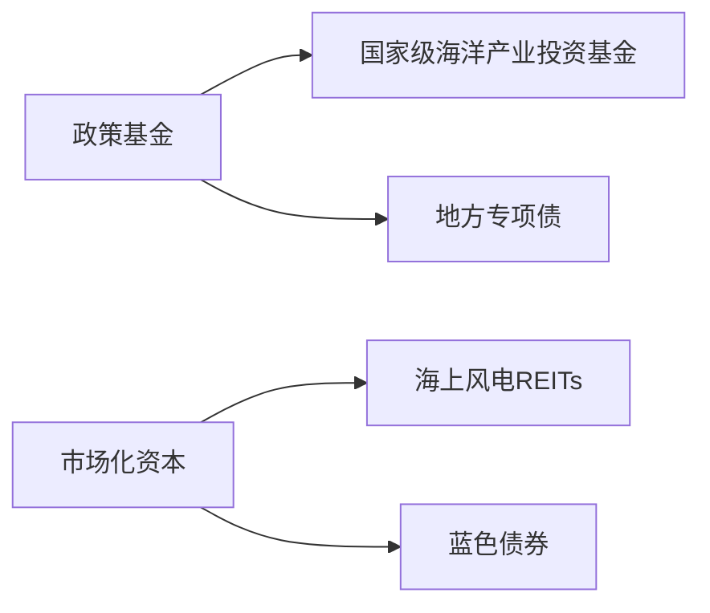

# 海洋经济专题研究报告：战略布局与产业机遇

## 简要部分（核心摘要）

### 主要话题与市场趋势概述
**全球海洋经济竞争升级为我国战略性新兴产业创造历史性窗口**。在陆地资源约束与技术革命共振下，海洋经济成为大国战略博弈与新质生产力培育的关键领域。我国依托产业规模优势（2024年海洋经济总量突破10万亿）、科技突破（深潜/钻探/观测技术）和政策体系（国家-部委-地方三级网络），正在加速从"海洋大国"向"海洋强国"跃迁，"十五五"规划聚焦科技、产业、生态三维度突破。

### 十大关键交易影响点
1. **海上风电装机量持续全球领跑驱动设备厂商订单增长**  
2. **"奋斗者号"深潜技术突破带动深海装备制造产业链升级**  
3. **海洋生物医药纳入新质生产力重点赛道刺激创新药企估值重构**  
4. **海洋碳汇核算体系完善催生蓝色碳交易市场建设机遇**  
5. **海湾经济区差异化定位引发区域基建投资结构性分化**  
6. **船舶工业全球市场份额扩张推升高端船舶制造溢价能力**  
7. **邮轮市场全球第二规模优势加速旅游消费场景创新**  
8. **立体化海域开发模式激活海洋空间资源利用效率**  
9. **国际海洋规则制定参与度提升利好跨境服务贸易企业**  
10. **AI+海洋观测网络建设拉动水下通信技术商业化进程**

---

## 详细分析

### 1. 事件概述
我国在"十五五"规划期全面推进海洋强国战略，政策重点覆盖科技突破（深海探测、AI赋能）、产业升级（风电/生物医药/高端船舶）、生态治理（碳汇体系）三大维度，目标构建万亿级海洋经济生态圈。

### 2. 核心驱动与投资逻辑
#### (1) 战略必要性驱动  
**资源安全逻辑**：陆地资源开发强度达62.3%临界值（自然资源部2023数据），深海矿产和生物基因库成为新资源争夺焦点。  
**经济转型逻辑**：海洋经济对GDP贡献率从2015年9.1%升至2024年11.4%，高出传统制造业增速2.3个百分点。  

#### (2) 产业升级路径  
**技术赋能层**：AI算法提升海洋勘探效率40%+（中海油实践数据），智能船舶渗透率目标2027年达35%。  
**价值链跃迁**：海洋服务业占比突破60%，高附加值环节（设计研发、检测认证）毛利率可达45-60%。  

#### (3) 资本配置图谱  

### 3. 相关资产影响
| 产业方向       | 受益领域                | 跟踪标的                     |
|----------------|-------------------------|------------------------------|
| **高端制造**   | 海工装备/智能船舶       | 船舶ETF(512660)、高端装备指数 |
| **清洁能源**   | 海上风电/漂浮式光伏     | 新能源ETF(516160)、环保证券  |
| **生物科技**   | 海洋生物医药/基因库     | 生物科技ETF(516500)          |
| **数字基建**   | 海洋感知网络/海底光缆   | 5GETF(515050)、数据中心指数  |
| **生态服务**   | 碳汇计量/生态修复       | 环保ETF(512580)              |

### 4. 风险警示与免责  
#### 关键风险维度：
- **政策落地风险**：海域使用权确权进度滞后可能延缓项目开工率  
- **技术转化风险**：深海探测技术商业化周期普遍超过7年（MIT研究数据）  
- **地缘不确定性**：关键航道（马六甲/霍尔木兹海峡）通行费波动影响海运成本  

> **免责声明**：本报告基于公开政策文件及行业数据推导，不构成投资建议。海洋经济项目普遍存在建设周期长（5-8年）、资本密集（单个风电项目投资超20亿）、技术迭代快等特点，投资者需结合资金久期审慎决策。报告观点可能随国际海洋公约修订及碳汇计量规则变更而调整。