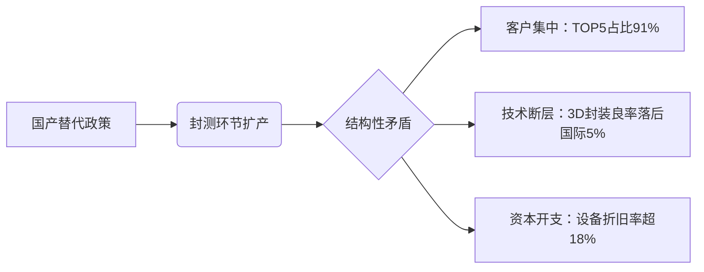

# 市场研究摘要：人工智能、半导体与金融板块关键趋势分析（2025年11月）

## 简要部分
### 主要话题与市场趋势概述
人工智能产业正从算力基建向应用场景价值挖掘加速转型，政策与技术突破双重驱动下AI语料/多模态需求激增；半导体行业呈现国产替代加速与结构性分化并存特征，封测环节产能扩张与客户集中风险凸显；银行板块非利息收入增长成为盈利新引擎，财富管理业务展现韧性。

### 交易影响最大的10个信息
1. **Sora 2模型推动AI视频生成商业化落地**，多模态技术加速渗透教育/医疗场景  
2. **国内高质量数据集建设政策密集出台**，海天瑞声等语料供应商订单激增  
3. **国际科技巨头融资规模超千亿美元**，Meta/谷歌发债投入AI数据中心建设  
4. **易方达人工智能ETF规模突破行业均值**，管理费率0.15%形成成本优势  
5. **盛合晶微IPO暴露封测行业风险**：第一大客户依赖度升至74.4%  
6. **功率半导体并购终止案例激增**，扬杰科技22亿收购案因经营理念分歧告终  
7. **银行业非利息收入同比增5%**，国有大行财富管理收入增速超20%  
8. **比亚迪研发投入超汽车三巨头之和**，前三季度研发费用437.5亿  
9. **黄金消费税新政引导场内交易**，品牌首饰金价突破1260元/克抑制消费需求  
10. **电子元器件板块波动加剧**，生益科技3日累计跌幅达9.24%  

---

## 详细部分

### 1. 人工智能领域分析
#### 事件概述
- OpenAI发布Sora 2模型并配套社交应用，实现音画同步生成技术突破  
- 国内"十五五"规划强化高技术产业支持，数据局牵头建设高质量语料库  
- 朝阳区设立3亿元具身智能产业基金，构建"基础研究-产业转化"全链条  

#### 核心驱动与投资逻辑
1. **技术迭代驱动**：物理模拟技术突破推动视频创作/智能营销等场景商业化进程  
2. **政策红利释放**：数据要素流通制度保障催化语料标注、3D建模等基础层需求  
3. **盈利模式转换**：Q3主要AI应用企业实现首次季度盈利，估值逻辑转向PEG定价  
4. **资本开支周期**：谷歌/Meta年内资本支出上调至900亿/720亿美元，算力基建仍具刚性需求  

#### 相关ETF及行业影响
- **易方达人工智能ETF（159819）**：覆盖海光信息（算力）、科大讯飞（算法）、视觉中国（语料）全产业链  
- **影响领域**：①AI语料标注服务商毛利率提升至45%+ ②多模态解决方案厂商订单增长超预期  
- **风险提示**：技术路线迭代风险/大模型监管政策变动/应用端业绩兑现不及预期  

### 2. 半导体领域关键动态
#### 事件概述
- 盛合晶微科创板IPO募资48亿扩产，但中段硅片加工产能利用率仅79%  
- 长川科技4日累跌12%创年内最大回撤，封测设备板块估值承压  
- 扬杰科技终止22亿收购贝特电子，282%溢价对赌条款未能弥合经营分歧  

#### 产业逻辑与风险传导

#### 潜在机会与风险
- **关注方向**：芯粒（Chiplet）封装技术、车规级IGBT测试设备  
- **风险预警**：①盛合晶微研发人员占比逼近科创板红线（11.1%）②设备厂商存货周转天数增至218天  

### 3. 银行与非银金融趋势
#### 核心数据透视
| 指标                | 国有大行 | 股份制行 | 城商行  |
|---------------------|---------|---------|--------|
| 非利息收入同比       | +15.6%  | +1.2%   | +8.3%  |
| 财富管理收入占比     | 22.7%   | 18.3%   | 9.6%   |
| 代理基金销售增幅     | 134%    | 89%     | 67%    |

#### 业务重心迁移
- **渠道变革**：招行/兴业代销基金APP活跃度环比提升27%  
- **产品创新**：江苏银行推出"科创积分+"信贷模型，不良率控制在1.02%  
- **资本压力**：TLAC监管要求下四大行资本缺口达1.2万亿  

### 4. 主要风险与免责声明
**关键风险提示：**
- **AI板块估值泡沫**：应用端PS中位数已达12.7x，偏离5年均值47%  
- **半导体产能过剩**：封测行业规划产能超实际需求1.8倍  
- **黄金政策冲击**：消费税新政或导致首饰加工成本上升15-20%  

**免责条款：**  
本报告数据来源于Wind、上市公司公告等公开信息，分析结论仅供参考，不构成任何投资建议。市场有风险，投资需谨慎。和讯网与报告制作方不对因使用本报告内容导致的损失承担任何责任。