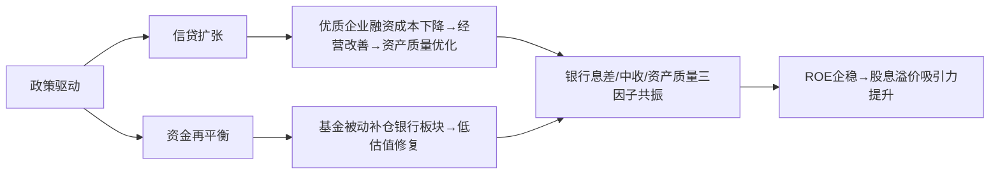

# 银行板块市场研究摘要

## 简要部分
**主要话题与市场趋势概述**  
当前银行板块聚焦于「普惠金融信贷扩张」与「公募基准改革驱动的配置再平衡」。政策端推动四大行联合授信池加速企业融资，叠加业绩基准改革催化低配银行板块修复，高分红属性强化防御价值。

**对交易影响最大的10个关键信息**：
1. **四大行（建行/中行/兴业/中信）联合推出"轻审负债"企业信用贷，最高额度920万/6天放款**  
2. 政策窗口期聚焦电子、电商、扩产型企业的优先信贷支持  
3. 公募业绩基准改革明确风格稳定性要求，监管约束基金投资偏离  
4. 银行板块主动偏股基金持仓占比1.82%（VS沪深300权重12.5%）严重低配  
5. **基金考核转向"长期稳定收益"，弱化短期抱团行为**  
6. Q3银行业净息差边际企稳（1.55%，环比降幅收窄至1BP）  
7. **中期分红力度维持高位，国有行股息率达6.5%+**  
8. 资本市场回暖推动银行中收同比增长4.6%（Q1-Q3）  
9. 存款利率下调缓解负债成本，但定期存款占比优化存压  
10. 城商行资本充足率承压（核心一级资本环比降2BP）  

---

## 详细部分

### 1. 事件与主题概述
- **普惠金融政策加码**：四大行组建联合授信池推出专项企业信用贷，通过简化负债审核（案例显示最低3.15%利率+6天放款）解决中小企业融资瓶颈。
- **公募基准改革落地**：证监会强化基金基准与投资策略匹配度，建立风格偏离监测机制，推动资金配置再平衡。
- **基本面韧性显现**：Q3银行息差企稳+中收回暖，叠加十五五规划转型催化，低估值高股息逻辑强化。

### 2. 核心驱动与投资逻辑
**阶梯式投资逻辑链**：

### 3. 潜在影响标的
| 领域              | 直接受益标的                               | 相关ETF                          |
|-------------------|------------------------------------------|---------------------------------|
| 对公信贷扩张      | 建行(0939.HK)、中信银行(0998.HK)          | 沪深300金融(512070)             |
| 高股息防御        | 中行(3988.HK)、农行(1288.HK)             | 银行ETF(512800)、H股ETF(510900) |
| 资本充足率改善预期 | 兴业银行(601166.SH)、宁波银行(002142.SZ) | 中证银行(399986)                |

### 4. 主要风险与免责
**关键风险点**：  
▸ 政策窗口期缩短导致信贷投放量不及预期  
▸ 基金基准调整进度滞后（1年过渡期存不确定性）  
▸ 经济复苏疲弱引发零售贷款不良率攀升  
▸ 美联储降息推迟引发的汇率与跨境资本波动  

**免责条款**：  
本报告基于公开信息分析，不构成投资建议。市场有风险，决策需独立研判。政策具体实施细则、企业信贷违约率变化、全球流动性转向等未被充分定价因子可能显著影响结论有效性。