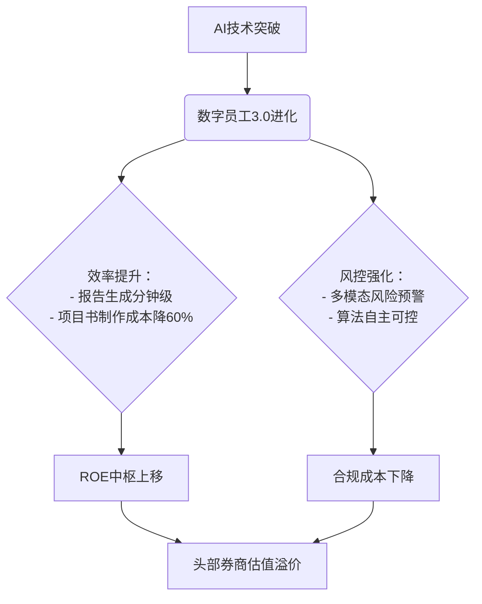

# 证券市场研究摘要：数字化转型与资金流动双重驱动

## 简要部分

### 主要话题与市场趋势概述
**券商行业正同时迎来技术升级（AI数字员工应用）与资金结构优化（居民存款搬家）双重变革**。头部券商加速推进AI技术嵌入核心业务流程，大幅提升运营效率；同时资本市场回暖带动居民储蓄向权益市场转移，为行业带来增量资金与业务机会。

### 十大关键交易影响信息
1. **中信证券上线18位数字员工，累计处理5000万次请求**（核心业务流程智能化提速）
2. **数字员工驱动人效提升300%**（"一人一团队"模式重构人力成本结构）
3. **AI投研报告生成效率较人工提升80倍**（研究业务边际成本大幅下降）
4. **10月居民存款减少1.34万亿，非银存款增1.85万亿**（资金搬家趋势确认）
5. **存款搬家指标差值收窄至1.49个百分点**（资金风险偏好持续改善）
6. **有效社融增速连续两月回升至5.57%**（实体融资结构优化）
7. **2026年预计政策利率调降10-20BP**（宽松流动性环境延续）
8. **央行重启国债买入扩表**（债券市场流动性支撑强化）
9. **票据融资同比多增3312亿**（中小微企业融资渠道拓宽）
10. **30城地产成交同比降26.6%**（资金转移股市逻辑强化）

---

## 详细部分

### 1. 事件主题概述
**双轮驱动格局形成**：  
- **技术变革**：中信证券领衔行业数字化转型，将数字员工深度嵌入投研（超级研究员）、投行（超级投行家）、运营（公出助理）等核心场景，实现业务流程智能化重构  
- **资金流动**：银河证券监测数据显示居民存款持续向资本市场迁移，10月非银存款增量创年内新高，印证股市赚钱效应引发的资产配置转换

### 2. 核心驱动与投资逻辑
#### 技术赋能逻辑链

#### 资金流动传导机制
**存款搬家三阶传导**：
1. **触发层**：股市超额收益（沪深300年化收益＞理财收益率300BP）
2. **监测层**：①存款增速差收窄 ②M1-M2剪刀差逆转 ③非银存款12MA持续上行
3. **业务映射**：经纪业务量价齐升（预计日均成交额突破1.2万亿）+ 资管规模扩张（预估流入资金占比AUM达15%-18%）

### 3. ETF/行业影响矩阵
| 影响维度       | 受益标的                     | 催化强度 |
|----------------|------------------------------|----------|
| **金融科技**   | 金融科技ETF(159851)          | ★★★★     |
| **头部券商**   | 券商ETF(512000)/中信证券     | ★★★☆     |
| **AI基础设施** | 云计算ETF(516510)/芯片ETF(512760) | ★★☆☆     |

**预期差异机会**：传统券商估值重心仍聚焦贝塔属性，数字员工带来的永续增长率提升（+1.2-1.5pct）尚未充分定价

### 4. 风险警示与免责
**技术应用风险**：  
- 算法黑箱风险（监管合规成本超预期）  
- 技术替代的反身性（人机协同磨合期业务波动）  
**资金流动风险**：  
- 美联储政策急转弯（当前市场隐含2026H2降息概率68%）  
- 地产政策超预期放松（30城销售企稳阈值＞月均成交1200万方）  

*免责声明：本报告基于公开信息分析，不构成任何投资建议。技术创新进度、政策落地节奏、市场风险偏好等关键变量可能显著改变预期路径。数据来源：央行金融统计、券商公开披露、万得资讯。截至2025年11月13日。*