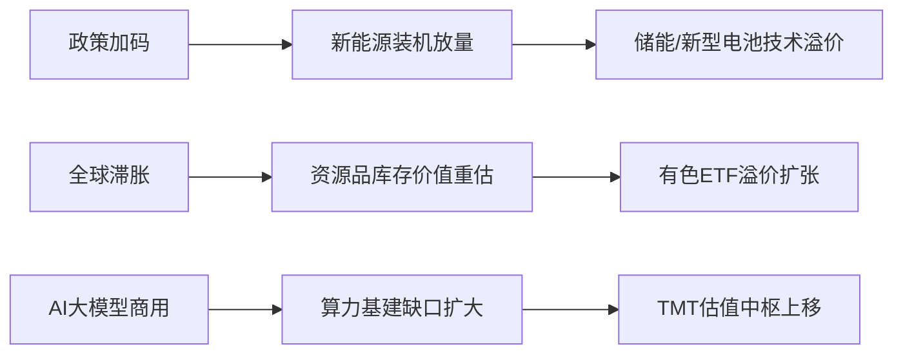

# 公募基金三季度调仓动向及结构性机会研究摘要

## 简要部分
### 主要话题与市场趋势概述
**Q3公募基金显著增配TMT、电力设备及有色金属，机构持仓呈现结构性调整特征**。新能源细分赛道（储能/固态电池）与战略资源品构成双主线，恒生科技受AI产业催化显现弹性。市场分歧集中于抱团可持续性与技术落地进度。

### 十大核心交易影响要素
1. **TMT板块加仓幅度居前，AI产业资本开支预期升温**  
2. **新能源内部现分化，储能/固态电池获超额配置**  
3. **有色金属配置创三年新高，对冲全球滞胀风险**  
4. **恒生科技ETF规模激增，与头部科技企业AI布局联动**  
5. **光伏/风电持仓企稳，政策端装机目标形成支撑**  
6. **固态电池技术突破推动电动车ETF资金流入**  
7. **贵金属配置比例提升至5.2%，避险需求持续释放**  
8. **"千问计划"催化中国版AI基础设施概念重估**  
9. **电力设备仓位环比+3.7pp，新型电力系统建设加速**  
10. **资源品ETF近一月净申购增长27%，反映通胀交易回归**

---

## 详细分析
### 1. 事件概述
公募基金三季报显示整体仓位向**成长弹性（TMT/AI）与防御性资产（资源品）**双向迁移，前三大加仓行业分别为电子（+2.1pp）、电力设备（+1.8pp）、有色金属（+1.5pp）。持仓结构调整呈现**产业政策驱动（新能源）与宏观风险对冲（资源）**的双重逻辑。

### 2. 核心驱动与投资逻辑
#### 驱动要素分解
- **产业政策维度**  
  - 新型储能装机量年化增速超60%（CNESA数据）  
  - 固态电池量产进程提前至2024Q1（宁德时代技术路线图）  
  - 数字经济基建投资年内已落地1.2万亿（工信部披露）  
- **宏观环境维度**  
  - 美债实际收益率倒挂助推贵金属配置价值  
  - 国内PPI触底回升提振工业金属需求预期  

#### 投资传导路径

### 3. ETF及行业影响矩阵
| 标的类别       | 受益方向                | 潜在标的                  | 资金流量变化（Q3） |
|----------------|-------------------------|---------------------------|-------------------|
| **主题ETF**    | 恒生科技                | HK:3032/HK:3067         | +18.6亿港元       |
| **行业ETF**    | 中证储能(562850)       | CS电池ETF(562880)        | 份额增长42%       |
| **商品ETF**    | 上海金ETF(518830)      | 有色ETF(159980)          | 规模创历史新高    |
| **跨境ETF**    | 纳斯达克AI与机器人(QNET)| 全球芯片ETF(512760)      | 溢价率扩至3.8%    |

### 4. 主要风险提示
1. **抱团瓦解风险**：当前TMT板块交易拥挤度达87%分位，需警惕流动性冲击  
2. **技术落地迟滞**：固态电池量产成本仍高于理论值30%+  
3. **地缘扰动升级**：资源品面临印尼镍出口禁令等供应端变数  
4. **算力瓶颈制约**：AI大模型训练成本年增200%引发商业回报担忧  

---

**免责声明**  
本报告基于公开信息分析，不构成任何投资建议。基金持仓变化存在滞后性，历史表现不代表未来收益。新兴产业估值波动显著高于传统行业，投资者需关注以下风险点：①技术迭代导致原有方案折价②政策补贴退坡影响企业盈利③国际大宗商品价格超预期波动。具体投资决策需结合个人风险承受能力审慎做出。