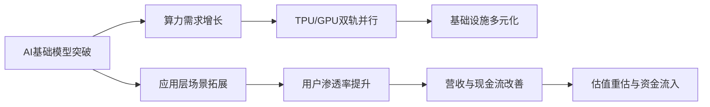

# 人工智能主题市场研究摘要  
**2025年11月28日 | 资深金融研究员**

---

## 简要部分  

### 主要话题与市场趋势概述  
人工智能（AI）正从基础技术突破向应用落地加速演进，成为驱动全球科技巨头估值重估与资本配置的核心主线。谷歌凭借Gemini大模型与TPU算力生态的双轮驱动，被顶级投资人视为“七巨头”中最值得持有的标的；与此同时，中国AI产业在DeepSeek等模型迭代推动下，应用层投资逻辑逐步强化。AI正从硬件投资主导向“硬件+应用”双主线演进，带动全产业链重估。

### 对交易影响可能最大的10个信息  
1. **谷歌Gemini 3大模型表现惊艳，成为抗衡OpenAI的关键力量**。  
2. **谷歌TPU有望于2027年为Meta数据中心供能，打破英伟达GPU垄断格局**。  
3. **Alphabet股价年内涨幅达70%，领跑“科技七巨头”，市值逼近4万亿美元**。  
4. **蒙斯特认为谷歌已重获AI竞争力，并激活内部竞争文化**。  
5. **当前仅约20%谷歌用户高频使用Gemini，渗透率提升空间巨大**。  
6. **Salesforce CEO公开称赞Gemini优于ChatGPT，增强市场信心**。  
7. **谷歌市盈率约28倍，具备芯片+AI聊天机器人双重赛道溢价基础**。  
8. **DeepSeek发布数学推理VR模型，推动AI应用预期升温**。  
9. **AI应用七大方向（工业、金融、教育、医疗、视觉、零售、自动驾驶）逐步兑现**。  
10. **AI硬件涨幅已高，资金正向应用端迁移，形成结构性轮动**。

---

## 详细部分  

### 1. 事件或主题概述  
近期人工智能主题热度持续上升，核心驱动力来自三方面：  
- **美国科技巨头层面**：谷歌发布Gemini 3大模型，并在TPU算力输出方面取得突破，引发对AI基础设施格局重构的预期；  
- **资本市场层面**：顶级投资人蒙斯特公开推荐Alphabet为“七巨头首选”，强化市场信心；  
- **中国AI生态层面**：DeepSeek等本土模型持续迭代，推动AI应用落地预期，叠加政策支持与资本涌入，形成“硬科技+应用”双轮驱动。

该主题情绪得分达0.80，主题得分0.90，显示市场关注度高且情绪积极。

### 2. 核心驱动与影响分析：投资逻辑分步解释  

#### 驱动一：谷歌AI全栈能力重塑市场地位  
- **技术突破**：Gemini 3在多模态理解与推理能力上达到GPT-4级别，甚至在部分任务中超越；  
- **算力输出**：TPU有望外供Meta，标志着谷歌从“自用封闭”转向“开放算力服务商”，拓展B端收入来源；  
- **竞争格局变化**：若Meta部分迁移到TPU，将削弱英伟达在AI训练市场的定价权，形成“英伟达+谷歌”双轨并行格局。

#### 驱动二：应用层渗透率提升带来增量空间  
- **用户基数优势**：谷歌拥有全球最广泛的搜索与Android生态触达能力，Gemini集成潜力巨大；  
- **使用率偏低**：目前仅约20%用户高频使用Gemini，意味着后续推广空间广阔；  
- **场景深化**：从搜索辅助向办公、教育、编程等场景延伸，提升用户黏性与商业价值。

#### 驱动三：中国AI应用进入落地验证期  
- **模型迭代加速**：DeepSeek等发布高精度数学推理模型，显示中国在垂直领域模型研发上的突破；  
- **政策与资本支持**：政府推动“新质生产力”，引导资金投向AI、半导体等战略领域；  
- **应用场景拓展**：工业智能化、金融风控、医疗影像等七大方向逐步实现商业化落地。

#### 投资逻辑链条  

### 3. 相关ETF或行业的潜在影响  

#### 美股市场  
- **Alphabet（GOOGL）**：最直接受益标的，具备“AI模型+算力+用户触达”三位一体优势；  
- **英伟达（NVDA）**：短期面临TPU竞争压力，但H100/DGX生态仍具领先优势，回调后具备长期配置价值；  
- **AI基础设施ETF**（如BOTZ、ROBO）：短期承压，但长期仍受益于整体资本开支上升。

#### A股与港股市场  
- **AI应用相关标的**：科大讯飞、金山办公、拓尔思等在NLP与办公场景具先发优势；  
- **算力与芯片链**：中芯国际、寒武纪、海光信息等受益于国产替代与需求增长；  
- **AI+行业标的**：恒生电子（AI+金融）、卫宁健康（AI+医疗）、拓普集团（AI+汽车）等迎来效率提升机遇。

#### 主题ETF  
- **人工智能主题ETF**（如工银人工智能、华夏人工智能）：配置AI全产业链，适合趋势性配置；  
- **云计算与大数据ETF**：间接受益于AI应用部署带来的云服务需求增长；  
- **科创板AI相关ETF**：聚焦硬科技与原创模型企业，弹性更高。

### 4. 主要风险与不确定性  

#### 技术风险  
- **模型迭代不及预期**：若Gemini或国产模型在实际部署中表现不稳定，将影响商业化进程；  
- **算力替代难度高**：CUDA生态壁垒深厚，TPU外供Meta仍需解决软件栈兼容性问题。

#### 市场风险  
- **估值回调压力**：Alphabet当前PE约28倍，已反映较高预期，若Q4业绩不及预期或引发调整；  
- **资金轮动风险**：若AI硬件回调，可能带动整体主题情绪降温。

#### 政策与地缘风险  
- **出口管制升级**：美国对华高端芯片与设备限制可能影响国内AI训练能力；  
- **数据监管趋严**：AI模型训练涉及数据合规问题，监管不确定性仍存。

#### 流动性风险  
- **美联储政策路径不确定**：若降息节奏放缓，高成长板块估值承压；  
- **机构持仓集中**：AI主题基金与ETF短期涌入明显，存在集中调仓引发波动风险。

---

### 免责条款  
本报告基于公开信息整理与分析，旨在提供客观的市场研究参考，不构成任何投资建议。投资者应结合自身风险承受能力、投资目标与财务状况独立判断，并自行承担投资风险。基金管理人过往业绩不代表未来表现，ETF价格波动可能造成本金损失。本报告不保证所引用数据的准确性与完整性，亦不对因使用本报告内容所导致的直接或间接损失承担责任。